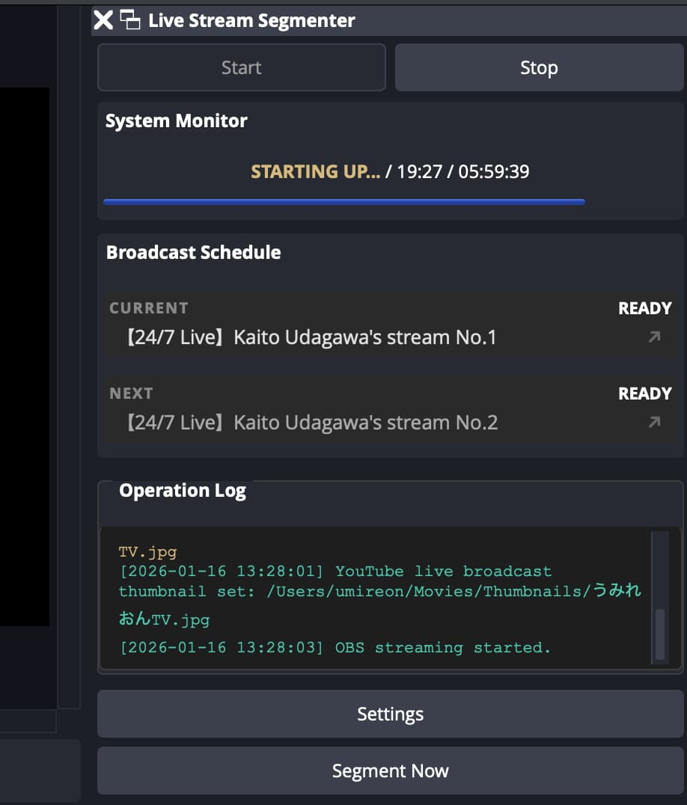

# Live Stream Segmenter

> Keep all the contents of your long stream archived on YouTube

## Overview

**Live Stream Segmenter** is an OBS automation plugin that has a dock UI to manage your broadcast and to keep the length of your stream less than 12 hours.

## Key Features

- All the automations will be based on YouTube Data API and YouTube Live Streaming API on your Google Cloud project.
- Every transition is carefully tested and the developer prioritizes the stream stability and availability.
- **Built-in timers** to renew the broadcast on YouTube automatically.
- **JS scripting interface** for streamers to control the information of their broadcast extensively.
- **Organized logging system** that will be shown on the dock UI and recorded on the log of OBS itself.
- **Intuitive status dock UI** and **user-friendly setup interface**

## Screenshot

  

## Requirements

- **OBS Studio** 31.1.1 or later
- **OS** Windows, Mac, Linux (Ubuntu, Arch Linux, Flatpak)
- **YouTube Account** that has live streaming permission
- **Google Cloud project** that has [YouTube Data API v3](https://console.cloud.google.com/marketplace/product/google/youtube.googleapis.com) enabled
- **OAuth2 Desktop Client** which belongs to your project, needs to be production but not verified is OK

## Development policy

We prioritize the compliance and ethics of our software projects as a member of global OSS community, and take the LLM concerns seriously.
While we use LLM-based code reviews to ensure that the quality of our software is satisfactory for every streamer, we always avoid including GenAI-generated content in our product.
Currently, the UI code is largely based on the GenAI-generated code and we are eagerly working on fixing this code.

## Download and installation

Go to [downloads page](https://kaito-tokyo.github.io/live-stream-segmenter/) to get the latest binary.

- **Windows:** Place the contents of zip into `C:\ProgramData\obs-studio\plugins`.
- **Mac:** Double-click the downloaded `.pkg`.
- **Ubuntu:** Install the provided `.deb`.
- **Arch Linux and Flatpak:** Use PKGBUILD or manifest available on [the supplementary repository](https://github.com/kaito-tokyo/live-plugins-hub).
- **Other Linux:** Build by yourself.

## Author

**Kaito Udagawa** (umireon@kaito.tokyo)

## Acknowledgments

Built with:
- [OBS Studio](https://obsproject.com/)
- [Qt Framework](https://www.qt.io/)
- [cURL](https://curl.se/)
- [fmt](https://github.com/fmtlib/fmt)
- [nlohmann/json](https://github.com/nlohmann/json)
- [QuickJS-ng](https://github.com/quickjs-ng/quickjs)
- [SQLite](https://sqlite.org/)
- [wolfSSL](https://www.wolfssl.com/)
- [zlib](https://github.com/madler/zlib)
